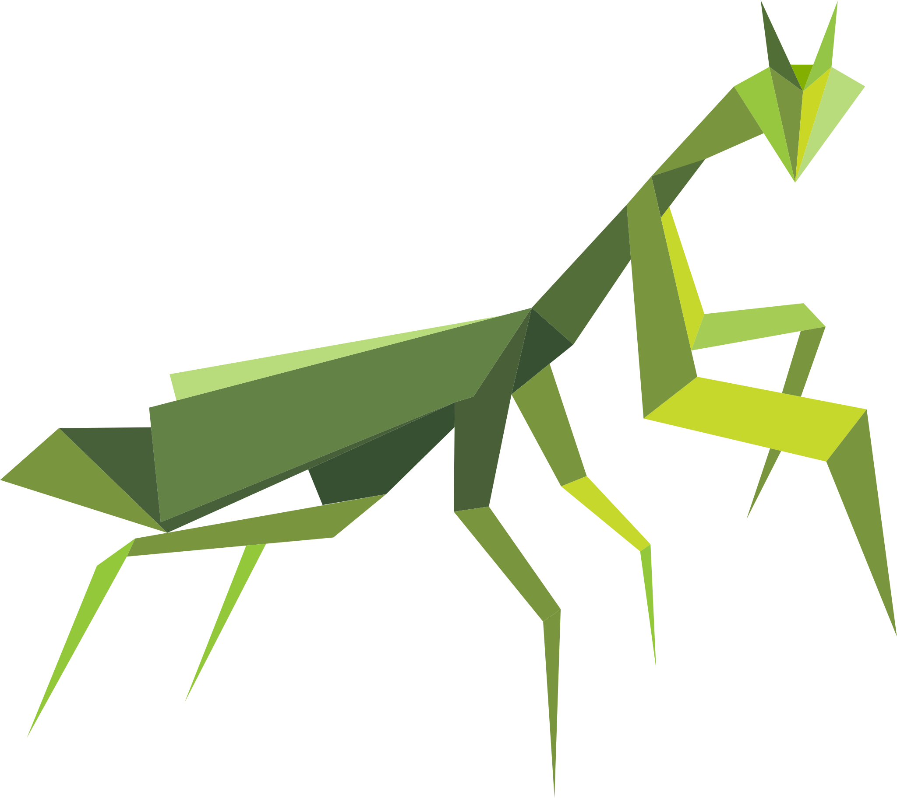

# Mantis

  
   
  

  

 

  
 

 

## About

Mantis is a REST API mocking tool, enabling you to mock any type of request, which makes development and running tests easier by not having to call a real service your app depends on. It is inspired by Wiremock and inherits some features to it.

I had the idea for Mantis when running a stress test at work using Wiremock to mock responses from various dependencies and realising it wasn't performing well and used too much resources to handle the throughput needed for the test.

The goal for Mantis is to be a fast and less resource-hungry alternative to other REST mocking tools available.

## Features

As of now, Mantis has all of the core features needed to be used in almost any scenario. But I intend to add more features over time, and of course, any pull request and suggestions are welcome!

- Easily mock any type of REST request
- Regex support
- JSON Path support
- Support for a Wiremock's `Scenario`-like feature
- Simulate production environments more accurately by defining delays on responses
- More to come

## Running It

To run Mantis, you can either define a Dockerfile and use `ghcr.io/dubonzi/mantis:latest` as your base image or download the executable from `https://github.com/dubonzi/mantis/releases`.

Mantis works by reading `Mapping` definitions which are JSON files containing information about the request you want mock such as HTTP Method, URL and other attributes, and also the corresponding response for that request. 

The default base paths Mantis reads mappings and responses files from is `files/mappings` and `files/responses` respectively. You can freely add subfolders and also configure these base paths. If running on Docker, don't forget to copy your definition files into the image when building.

The full documentation can be found [here](https://dubonzi.github.io/mantis). There's also an [example repository](https://github.com/dubonzi/mantis-example).

## Credits

Thanks [Myond](https://instagram.com/bymyond) for the logo and images!